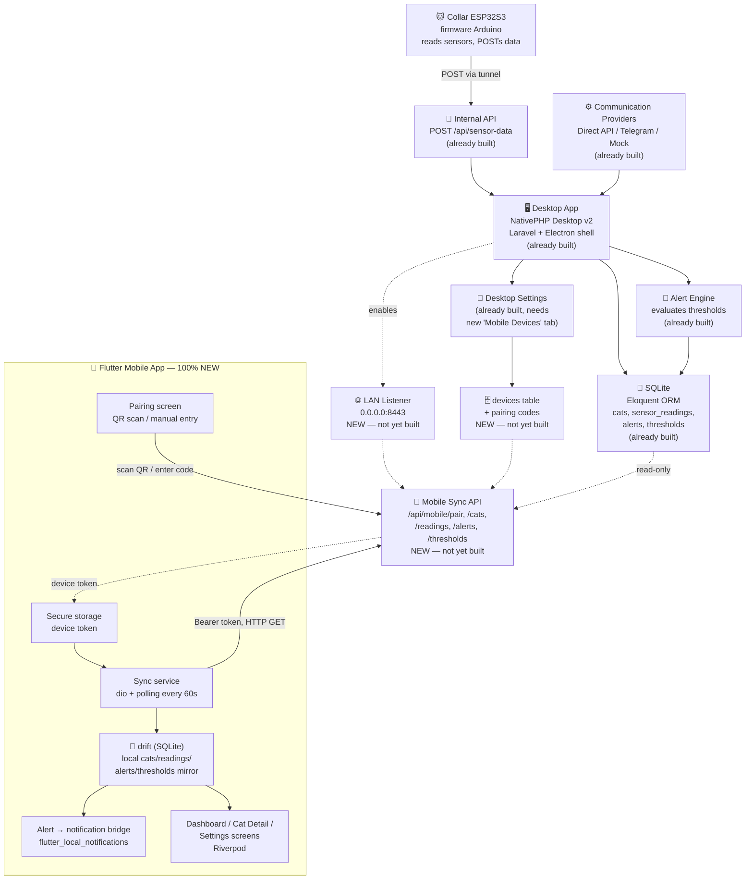

# Architecture Decision Record — Mobile Companion (Flutter)

**Project:** Smart Cat Collar — Mobile Companion App (Flutter)
**Date:** 2026-08-03
**Author:** Fabio

> This ADR documents a **Flutter-based alternative** for the mobile companion app. It does **not** modify or replace `ADR.md` (the Laravel/NativePHP desktop hub) or any file in `.specs/plans/`. The desktop app remains the central data hub exactly as decided in `ADR.md`. This document only proposes a different technology for the **mobile client** described in `.specs/plans/feature-mobile-app.md` and `.specs/plans/feature-mobile-sync.md` — it is a parallel option, not a superseding decision. Which mobile stack actually ships (NativePHP Mobile vs. Flutter) is left open until the user decides.
>
> **This document is self-contained.** A developer or agent building the Flutter app is assumed to have **no access** to the Laravel codebase, its models, migrations, or the other `.specs/plans/*.md` files. Every data field, enum value, API endpoint, and schema needed to build the mobile app is spelled out below — see [Complete Technical Specification](#complete-technical-specification). Anything not written explicitly in this file should not be assumed.

## Decision

Build the mobile companion app as a **native Flutter app** (Dart), instead of NativePHP Mobile v3, while keeping the **desktop app (Laravel + NativePHP Desktop) as the unchanged central data hub**. The Flutter app is a read-only client of the desktop's mobile sync API: it pairs with the desktop via a one-time code, then pulls delta syncs (cats, sensor readings, alerts, thresholds) into its own on-device SQLite database (via `drift`), and raises local push notifications for `critical` alerts.

## Context

`ADR.md` establishes the desktop app as the always-on data hub that the collar POSTs to, and defines a LAN-only, read-only, pairing-code-based sync API for mobile clients (`.specs/plans/feature-mobile-sync.md`). That plan and `.specs/plans/feature-mobile-app.md` assume the mobile client is also built with NativePHP Mobile v3, sharing the Laravel codebase and Livewire views.

Flutter is being evaluated as an alternative mobile client because:

- It produces a genuinely native, higher-performance mobile UI than a webview-based Livewire client
- It has a larger ecosystem for offline-first sync, local push notifications, and platform-specific polish (Android + iOS)
- `nativephp/mobile` is a newer, less proven package (v3) — a native Flutter client reduces risk if that package's mobile story doesn't mature in time

The mobile app's **scope and constraints do not change** — only the implementation technology. Everything already decided in `ADR.md` about the sync contract (pairing, devices table, read-only v1, LAN-only v1) is treated as a fixed backend contract that the Flutter app must consume unchanged.

## Architecture diagram

This adapts the existing `architecture.mmd` (desktop hub) to show where the Flutter app fits and what's new (dashed nodes) vs. already built (solid nodes).



## Chosen platforms

- **Frontend:** Flutter (Dart) — single codebase for Android + iOS
- **State management:** Riverpod
- **Local database:** `drift` (type-safe Dart ORM over SQLite) — on-device offline-first copy, mirrors the desktop's Eloquent schema for `cats`, `sensor_readings`, `alerts`, `thresholds`
- **Backend:** unchanged — the existing Laravel desktop app's mobile sync API (`routes/api.php`, see `.specs/plans/feature-mobile-sync.md`)
- **Networking:** `dio` or `http` package, JSON, token-based auth (device token from pairing)
- **Local push notifications:** `flutter_local_notifications` — no remote push server in v1, consistent with `ADR.md` decision #9
- **Build (Android):** Flutter's standard `flutter build apk` / `flutter build appbundle` — distinct app ID from the desktop build (e.g. `com.smartcatscollar.mobile`)
- **Build (iOS):** `flutter build ipa` — deferred, requires macOS + Xcode + Apple Developer account (same constraint as the NativePHP plan)
- **Deploy:** Google Play / App Store — future phase, same as `ADR.md`

## Main components

| Component | Responsibility |
| --- | --- |
| **Flutter app shell** | Native Android/iOS app, Riverpod for state, Material/Cupertino adaptive UI |
| **Pairing screen** | Enter the desktop's single-use pairing code (or scan QR); exchanges it for a long-lived device token via `POST /api/mobile/pair` |
| **Secure token storage** | `flutter_secure_storage` (Keychain/Keystore) for the device token — never stored in plaintext prefs |
| **Sync service** | Polls the desktop's read-only endpoints (`/api/mobile/cats`, `/readings`, `/alerts`, `/thresholds`) on launch, pull-to-refresh, and a timed interval; upserts deltas into local `drift` tables |
| **Local database (drift)** | On-device SQLite mirror of `cats`, `sensor_readings`, `alerts`, `thresholds` — read-only from the desktop's perspective, keeps the app usable offline |
| **Dashboard / Cat detail screens** | Native Flutter UI equivalents of the desktop's Livewire Dashboard and CatDetail views — same data, native widgets instead of Blade |
| **Alert → local notification bridge** | When a delta sync pulls a new `critical` alert, schedule a `flutter_local_notifications` push; `warning` stays in-app only |
| **Settings screen (mobile-side)** | Shows paired device name, last sync time, manual "sync now", and app-level preferences (notification toggle) — thresholds/providers remain desktop-edited per `ADR.md` |
| **Connectivity/offline handling** | Detects LAN reachability to the desktop host; falls back to last-synced local data when unreachable, matching the desktop's offline-first constraint |

## Architectural decisions

### 1. Flutter (native) instead of NativePHP Mobile (Laravel webview)

**Alternative:** `nativephp/mobile` v3 — same Laravel/Livewire codebase wrapped for Android/iOS, as planned in `.specs/plans/feature-mobile-app.md`.

**Chosen option (this ADR):** A standalone Flutter app, fully decoupled from the Laravel codebase, talking to the desktop only over HTTP.

**Why:**

- True native rendering and platform idioms (navigation, gestures, notifications) instead of a webview
- Avoids depending on the maturity of `nativephp/mobile` v3 for a production mobile release
- Clean separation: the desktop app never needs to know or care what technology the mobile client uses, since the contract is just the sync API

**Trade-offs:**

- Two codebases/languages (PHP + Dart) instead of one — loses the single-codebase benefit from `ADR.md` decision #1
- Mobile UI (Dashboard, CatDetail, Settings) must be rebuilt natively in Flutter rather than reusing Livewire views
- A second build toolchain (Flutter SDK, Android/iOS tooling) alongside the Electron/NativePHP toolchain

### 2. Reuse the existing sync API contract unchanged

**Alternative:** Design a new/different API shape for a Flutter client (e.g. GraphQL, WebSocket-first).

**Chosen option:** Consume the exact REST/JSON, pairing-code + device-token, LAN-only, read-only sync API defined in `.specs/plans/feature-mobile-sync.md`, with no backend changes.

**Why:**

- The desktop-side contract is already designed and matches the offline-first, read-only-v1 constraints in `ADR.md`
- Keeps the backend implementation technology-agnostic — any future mobile client (Flutter, React Native, NativePHP) can use the same endpoints
- Avoids re-litigating auth/pairing/device-revocation decisions already made

**Trade-off:** Polling (not push) for sync in v1, same limitation as the NativePHP plan — real-time sync remains a roadmap item (WebSocket provider) regardless of mobile technology.

### 3. `drift` for local storage instead of raw `sqflite`

**Alternative:** `sqflite` with hand-written SQL and manual migrations.

**Chosen option:** `drift`, a type-safe Dart ORM over SQLite with compile-time-checked queries and a structured migration system.

**Why:**

- Mirrors the desktop's Eloquent-model approach (schema-first, migration-driven) conceptually, even though the two are unrelated codebases
- Reduces hand-written SQL bugs when upserting sync deltas
- Built-in reactive streams pair naturally with Riverpod for live UI updates as sync data arrives

### 4. Riverpod for state management

**Alternative:** `Provider`, `Bloc`/`Cubit`, or `GetX`.

**Chosen option:** Riverpod.

**Why:**

- Compile-safe dependency injection, easy testability, and first-class async/stream support — a good fit for a sync service that streams data from `drift` and from the network
- Scales cleanly as screens are added (Dashboard, CatDetail, Settings, Pairing) without a global service locator

### 5. Local-only push notifications (no remote push server)

**Alternative:** Firebase Cloud Messaging (FCM) / Apple Push Notification service (APNs) triggered from a server.

**Chosen option:** `flutter_local_notifications`, scheduled on-device after a sync delta reveals a new `critical` alert — identical constraint to `ADR.md` decision #9.

**Why:**

- No cloud/server component exists in this architecture; adding remote push would require standing one up
- Consistent behavior with whichever mobile client ships — the notification trigger is "a new critical alert appeared in the local synced data," not a server push event

**Trade-off:** Same as the NativePHP plan — if the desktop is off or unreachable, the Flutter app won't learn about new alerts until its next successful sync.

## What already exists vs. what must be built

**Already built (desktop, Laravel — read-only reference, not to be reimplemented):**

- `Cat`, `SensorReading`, `Alert`, `Threshold` Eloquent models + migrations (schema reproduced in full below)
- `POST /api/sensor-data` — collar ingestion endpoint (not used by mobile)
- Desktop Dashboard/Settings Livewire UI, `AlertEngine` (threshold evaluation)

**NOT built yet — required before the Flutter app can sync with real data:**

- The entire `devices` table, pairing-code generation, and the `/api/mobile/*` endpoints below (currently only `/api/sensor-data` exists in `routes/api.php`)
- A LAN-reachable HTTP listener for the desktop app (see [Network Discovery](#network-discovery--base-url) — NativePHP's dev/internal server binds to `localhost` by default, so exposing it on the LAN is desktop-side work not yet done)
- The alert-created event/listener plumbing that would let alerts be pushed out at all (today alerts are only DB rows)

**Must be built from scratch (Flutter side — 100% new):** the entire mobile app — UI, local database, networking, notifications, pairing flow. There is no existing Flutter code in this repository to build on.

> Until the desktop-side sync API exists, the Flutter app should be developed against a **mock/local server** (e.g. `json_server`, a Postman/WireMock stub, or an in-memory fake) that returns responses matching the exact JSON shapes defined in [API Endpoint Contracts](#api-endpoint-contracts). Swapping the base URL to the real desktop once it implements these endpoints should require no client code changes if the contract is followed exactly.

## Complete Technical Specification

This section is the authoritative reference for building the Flutter app without access to the Laravel codebase.

### Backend data model reference

All timestamps are ISO 8601, UTC (e.g. `2026-08-03T10:15:00Z`). All IDs are integers (auto-increment, desktop-assigned) — the mobile app never generates entity IDs, only the device pairing flow does.

**`cats`**

| Field | Type | Notes |
| --- | --- | --- |
| `id` | int | Primary key |
| `name` | string | Required |
| `breed` | string \| null | Optional |
| `photo_path` | string \| null | Relative path; may be `null` — no photo sync endpoint in v1, treat as display-only text or omit image if null |
| `birth_year` | int \| null | Optional |
| `status` | enum: `healthy` \| `warning` \| `critical` | Derived by the desktop from the latest reading vs. thresholds |
| `created_at`, `updated_at` | datetime | |

**`sensor_readings`**

| Field | Type | Notes |
| --- | --- | --- |
| `id` | int | Primary key |
| `cat_id` | int | Foreign key → `cats.id` |
| `temperature` | float | Degrees Celsius, e.g. `38.5` |
| `bpm` | int (unsigned) | Beats per minute |
| `activity` | enum: `low` \| `medium` \| `high` | |
| `source` | enum: `direct_api` \| `telegram` \| `mock` | Where the reading originated (desktop-side); display-only on mobile |
| `read_at` | datetime | When the sensor took the reading (use this for chronological ordering, not `created_at`) |
| `created_at`, `updated_at` | datetime | |

**`alerts`**

| Field | Type | Notes |
| --- | --- | --- |
| `id` | int | Primary key |
| `cat_id` | int | Foreign key → `cats.id` |
| `type` | enum: `warning` \| `critical` \| `info` | **Note:** three values exist, not two — `info` alerts exist alongside `warning`/`critical`. Only `type == 'critical'` triggers a local push notification; `warning` and `info` are in-app only |
| `vital` | enum: `temperature` \| `bpm` \| `activity` | Which vital triggered the alert |
| `value` | string | The offending reading's value, stringified (e.g. `"39.8"`) |
| `threshold` | float \| null | The threshold value that was crossed |
| `message` | string | Human-readable message, e.g. "Whiskers' temperature is critically high (39.8°C)" — use this verbatim as notification body |
| `acknowledged_at` | datetime \| null | `null` = still active/unacknowledged |
| `created_at`, `updated_at` | datetime | Use `created_at` for "new since last sync" comparisons |

**`thresholds`**

| Field | Type | Notes |
| --- | --- | --- |
| `id` | int | Primary key |
| `cat_id` | int \| null | `null` = global default applying to all cats without a per-cat override |
| `vital` | enum: `temperature` \| `bpm` | Only these two vitals have configurable numeric thresholds (`activity` alerts are rule-based on the desktop, not threshold-based) |
| `warning_value` | float | |
| `critical_value` | float | |
| `created_at`, `updated_at` | datetime | |

Resolution rule (desktop-side, already implemented): for a given cat + vital, use the per-cat row if one exists, otherwise fall back to the row where `cat_id IS NULL`. The mobile app does not need to reimplement this — thresholds are fetched read-only for display (e.g. "Warning at 39.0°C, Critical at 39.5°C" on the Cat Detail screen).

### Devices & pairing (new — must be designed/built, not yet in the codebase)

**`devices` table (desktop-side, to be created):**

| Field | Type | Notes |
| --- | --- | --- |
| `id` | int | Primary key |
| `name` | string | Device label, e.g. "Fabio's Pixel 8" — set by mobile at pairing time, editable later from desktop Settings |
| `token_hash` | string | SHA-256 hash of the device token; plaintext token is returned to the client exactly once, at pairing time, and never again |
| `paired_at` | datetime | |
| `last_seen_at` | datetime \| null | Updated by the desktop on each authenticated request |
| `revoked_at` | datetime \| null | Soft revocation — a revoked device's token is rejected with `403` |

**Pairing code:** 6-digit numeric string (e.g. `"482913"`), generated and displayed by the desktop Settings UI, single-use, 10-minute TTL.

**Device token:** 64-character hex string (32 random bytes), returned once by `POST /api/mobile/pair`. Store it immediately in `flutter_secure_storage` under the key `device_token` — it cannot be retrieved again; if lost, the user must re-pair.

### Network discovery & base URL

**Assumption (flag to the desktop implementer if not already true):** NativePHP's built-in server binds to `localhost` only. For the LAN-only mobile sync to work at all, the desktop app must additionally bind a listener to `0.0.0.0` on a configurable port (proposed default: `8443`) when mobile sync is enabled in Settings. This is a desktop-side prerequisite, not something the Flutter app can work around.

**Pairing hand-off (proposed):** the desktop Settings "Mobile Devices" tab shows a QR code encoding:

```json
{
  "host": "192.168.1.20",
  "port": 8443,
  "code": "482913",
  "expires_at": "2026-08-03T10:10:00Z"
}
```

The Flutter app scans this (via the `mobile_scanner` package) and also offers a manual fallback form (host, port, 6-digit code) for devices without a camera or when QR scanning fails. Base URL for all subsequent requests is `http://{host}:{port}`.

### API endpoint contracts

All endpoints are JSON over HTTP. Base path: `/api/mobile`. Authenticated endpoints require header `Authorization: Bearer {device_token}`.

**1. `POST /api/mobile/pair`** *(not authenticated)*

Request:

```json
{ "code": "482913", "device_name": "Fabio's Pixel 8" }
```

Response `200 OK`:

```json
{ "device_id": 3, "token": "9f2c...64 hex chars total", "paired_at": "2026-08-03T10:00:00Z" }
```

Errors: `404` `{ "error": "invalid_or_expired_code" }`, `422` `{ "error": "device_name_required" }`

**2. `GET /api/mobile/cats`** *(authenticated)*

Response `200 OK`:

```json
{ "data": [ { "id": 1, "name": "Whiskers", "breed": "Tabby", "photo_path": null, "birth_year": 2022, "status": "healthy", "created_at": "...", "updated_at": "..." } ] }
```

Full list every call (cats are few — no `since` param needed).

**3. `GET /api/mobile/readings?since={iso8601}`** *(authenticated)*

`since` optional; omit or use an epoch date for a full initial sync. Response `200 OK`:

```json
{ "data": [ { "id": 101, "cat_id": 1, "temperature": 38.6, "bpm": 140, "activity": "medium", "source": "mock", "read_at": "2026-08-03T09:55:00Z", "created_at": "...", "updated_at": "..." } ], "server_time": "2026-08-03T10:00:05Z" }
```

Use the returned `server_time` (not the device's local clock) as the `since` value for the *next* call, to avoid clock-skew gaps.

**4. `GET /api/mobile/alerts?since={iso8601}`** *(authenticated)* — same shape/pattern as `readings`, rows matching the `alerts` table above.

**5. `GET /api/mobile/thresholds`** *(authenticated)* — full list every call (small dataset), rows matching the `thresholds` table above.

**Error format (all authenticated endpoints):** `401 { "error": "invalid_token" }` (bad/missing token), `403 { "error": "device_revoked" }` (token valid but device revoked). On either, the Flutter app should clear the stored token and route the user back to the pairing screen.

### Local database schema (drift)

Mirror the four synced entities plus two local-only tables:

- `CatsTable`, `SensorReadingsTable`, `AlertsTable`, `ThresholdsTable` — same columns/types as the backend tables above (drift `IntColumn`/`RealColumn`/`TextColumn`/`DateTimeColumn`, enums stored as `TextColumn` with a Dart enum mapper)
- `SyncStateTable` — one row per entity name (`cats`, `readings`, `alerts`, `thresholds`) storing `last_synced_at` (nullable datetime); drives the `since` param for the next poll
- `DeviceTable` — single row: `host`, `port`, `device_name`, `paired_at` (the token itself lives in `flutter_secure_storage`, not in drift, since drift's SQLite file is not guaranteed to be encrypted at rest)

Upsert strategy: `InsertMode.insertOrReplace` keyed by `id` for all four synced tables — the desktop is always the source of truth, last-write-wins from the desktop's perspective (v1 is read-only, so there's never a local write to conflict with).

### Sync algorithm

Triggered on: app launch, app resume from background, pull-to-refresh, and a 60-second foreground timer (no background sync in v1 — see Non-functional requirements).

1. If no device token is stored, show the Pairing screen and stop.
2. `GET /cats` and `GET /thresholds` (full fetch) → upsert into drift.
3. `GET /readings?since={SyncStateTable.readings.last_synced_at}` → upsert into drift → update `SyncStateTable.readings.last_synced_at` to the response's `server_time`.
4. `GET /alerts?since={SyncStateTable.alerts.last_synced_at}` → **before upserting**, diff incoming rows against what's already in `AlertsTable` to find genuinely new rows; upsert; update `SyncStateTable.alerts.last_synced_at`.
5. For each newly-seen row from step 4 where `type == 'critical'`, schedule a local notification (see below).
6. Any network failure at any step: keep previously synced data, show a non-blocking "offline / last synced at HH:mm" banner, retry on the next trigger (see retry policy below).

### Notification mapping

- Trigger: a row from step 4/5 above with `type == 'critical'` that wasn't already in the local database.
- Title: `"🚨 {cat.name} needs attention"` (look up `cat.name` from `CatsTable` by `cat_id`).
- Body: the alert's `message` field, verbatim.
- Tapping the notification deep-links to the Cat Detail screen for `cat_id`.
- `warning` and `info` alerts: in-app only (e.g. a badge/counter on the Dashboard), no push.
- Request notification permission (`flutter_local_notifications` + platform permission plugins) on first launch, after pairing succeeds — not before, so the permission prompt has context.

### Non-functional requirements

- **Polling interval:** 60 seconds while the app is in the foreground. No background/headless sync in v1 (would require platform-specific background execution work — out of scope, matches "no remote push server" trade-off already accepted).
- **Timeouts:** 10s connect, 15s receive (via `dio`'s `Options`).
- **Retry policy:** on failure, retry up to 3 times with exponential backoff (1s, 2s, 4s) within the same sync cycle; if still failing, wait for the next trigger — do not retry indefinitely in a tight loop.
- **Connectivity check:** a lightweight `GET /api/mobile/cats` with a short (3s) timeout is used to flip an "offline" banner; also listen to `connectivity_plus` for basic Wi-Fi/no-network state to avoid firing requests with zero chance of success.

### Flutter project structure (proposed)

```
lib/
  main.dart
  app/                     # MaterialApp, routing, theming
  core/
    network/                # dio client, API endpoint wrappers, error mapping
    storage/                 # drift database, DAOs, secure token storage
    notifications/           # flutter_local_notifications setup + scheduling
  features/
    pairing/                 # QR scan + manual entry screens, pairing use case
    dashboard/                # cat list/status cards
    cat_detail/               # readings chart, alert history for one cat
    settings/                  # paired device info, last sync, notification toggle
  data/
    models/                    # Dart freezed/plain classes for Cat, SensorReading, Alert, Threshold, Device
    repositories/                # sync service, upsert logic, since-tracking
```

### Key dependencies (pubspec.yaml)

| Package | Purpose |
| --- | --- |
| `flutter_riverpod` | State management |
| `drift` + `drift_dev` + `sqlite3_flutter_libs` | Local offline-first database |
| `dio` | HTTP client for the sync API |
| `flutter_secure_storage` | Device token storage (Keychain/Keystore) |
| `flutter_local_notifications` | Local push for `critical` alerts |
| `mobile_scanner` | QR pairing code scanning |
| `connectivity_plus` | Basic network-state awareness |
| `intl` | Date/time formatting for readings and alert timestamps |

## Constraints

- **Does not modify** `ADR.md`, `architecture.mmd`, or any file in `.specs/plans/` — this is an additive, parallel document
- **Desktop remains the central data hub** — no change to collar → desktop ingestion, providers, or the Alert Engine
- **Mobile sync stays LAN-only, read-only, pairing-code-based (v1)** — same as `.specs/plans/feature-mobile-sync.md`; tunnel-based remote sync remains a shared roadmap item
- **No camera or biometrics** on mobile — data display only, same as `ADR.md`
- **Distinct app ID** from both the desktop build and any NativePHP mobile build, if both are ever built (e.g. `com.smartcatscollar.mobile.flutter` during evaluation, finalized before store submission)
- **Offline-first** — `drift`-backed local SQLite must let the app function fully with last-synced data when the desktop is unreachable
- **Alert severities: `critical` / `warning` only** — no `emergency`, consistent with the `Alert` model
- **Android build prerequisites:** Flutter SDK, Android SDK, Java 17-compatible toolchain; **iOS:** macOS + Xcode + Apple Developer account (deferred, same as the NativePHP plan)
- **.gitignore additions (if this path is adopted):** `**/.dart_tool/`, `**/build/`, Flutter/Android/iOS platform build artifacts

## What is NOT in scope

- **Any change to the desktop app, its ADR, or its `.specs/plans/` files** — this document is purely additive
- **A decision on which mobile stack ships** — Flutter vs. NativePHP Mobile is left open; both remain documented options until the user chooses
- **Backend/API redesign** — the sync API contract from `.specs/plans/feature-mobile-sync.md` is reused as-is
- **Remote (non-LAN) sync** — same roadmap item as the rest of the project, not solved by switching to Flutter
- **Camera, biometrics, GPS** — same exclusions as `ADR.md`
- **Store publishing** — future phase, after a mobile stack is chosen and hardware is validated
- **Write-back from mobile** (editing thresholds/settings) — v1 is read-only regardless of mobile technology
- **iOS build/signing pipeline** — deferred pending Mac + Apple Developer account access

## Planned future features

- Decide Flutter vs. NativePHP Mobile as the shipped mobile client
- Tunnel-based remote sync (shared roadmap item, technology-agnostic)
- WebSocket-based real-time sync instead of polling (shared roadmap item)
- iOS build pipeline once Mac/Apple Developer access is available
- Mobile write-back (editing thresholds/settings from the phone), with conflict handling
</content>
