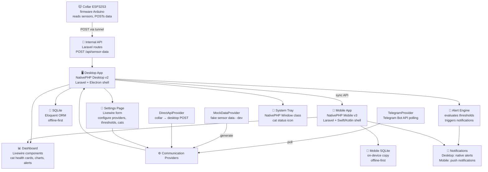

# Architecture Decision Record

**Project:** Smart Cat Collar — Desktop & Mobile Companion App
**Date:** 2026-07-22
**Author:** Fabio

## Decision

Build a single Laravel codebase that powers both a **Desktop companion app** (via NativePHP Desktop v2) and a **Mobile companion app** (via NativePHP Mobile v3) for the Smart Cat Collar health monitoring system.

The **desktop app is the central data hub** — it exposes an internal API that the collar can POST sensor data to directly (via tunnel). Communication channels are configurable via a settings page, so the project is not locked into a single provider.

One codebase, one set of views (responsive Blade/Livewire), one Eloquent data layer — deployed to Windows/Linux/macOS (desktop) and Android/iOS (mobile).

## Context

The Smart Cat Collar is a real hardware project — an ESP32S3 Sense with temperature, heart rate, accelerometer, camera, and microphone sensors that monitors cat health and sends alerts.

Students in the Multistack course Week 4 Session B need to see a **real product** built live, not a toy demo. The desktop companion app is the live build. The mobile companion comes after, from the same codebase.

**Key constraints from the project:**

- The desktop app is the primary data receiver — it exposes an internal API (via tunnel) that the collar POSTs to
- We do NOT want to be Telegram-dependent — Telegram is one possible channel, not the only one
- Communication channels are configurable in the desktop app (settings page) — pick different providers as the project develops
- Mobile companion does NOT need camera or biometrics — only data display
- Sensor data is **mocked** until the ESP32 device is assembled
- The app must work offline-first on both platforms

## Architecture Diagram



> Note: each platform has its **own** SQLite database (offline-first). The mobile app does not read the desktop's database file directly — it receives data from the desktop's sync API and stores a local copy. See `.specs/plans/feature-mobile-sync.md`.

## Chosen platforms

- **Desktop framework:** NativePHP Desktop v2 (Laravel + Electron shell)
- **Mobile framework:** NativePHP Mobile v3 (Laravel + Swift/Kotlin shell)
- **Frontend:** Laravel Blade + Livewire (responsive — same views on both platforms)
- **Database:** Eloquent + SQLite (offline-first, embedded in both builds)
- **CSS:** Tailwind CSS (responsive)
- **Build (desktop):** `php artisan native:build` → `.exe` / `.AppImage` / `.dmg`
- **Build (mobile):** NativePHP Mobile build pipeline → `.apk` / `.aab` / `.ipa`
- **Deploy (desktop):** GitHub Releases (auto-update via electron-updater)
- **Deploy (mobile):** App Store / Google Play (future)

## Main components

| Component | Responsibility |
| --- | --- |
| **Collar firmware (ESP32S3)** | Reads sensors, POSTs data to the desktop app's internal API — separate project, not in this codebase |
| **Desktop app (NativePHP)** | Central data hub — receives collar data via internal API, stores in SQLite, displays dashboard, manages settings, system tray, alert logic |
| **Mobile app (NativePHP Mobile)** | Same data displayed on mobile — responsive Livewire views, local push notifications for alerts, own on-device SQLite |
| **Internal API (Laravel routes)** | REST endpoint exposed by the desktop app — the collar POSTs sensor data here. Accessible via tunnel (ngrok, Cloudflare Tunnel, etc.) |
| **Mobile sync API (Laravel routes)** | Read-only API exposed by the desktop app — mobile pairs with a one-time code, then pulls delta syncs of cats, readings, alerts, thresholds. See `.specs/plans/feature-mobile-sync.md` |
| **Notification fan-out (event + listener)** | Laravel event fired when the Alert Engine creates a `critical` alert; listener dispatches to the right channel — desktop native notification, or alert record that mobile picks up via sync and raises as a local push |
| **Communication providers** | Pluggable data sources — configurable in settings. Initially: Direct API (collar → desktop) + Telegram (fallback). Future: MQTT, WebSocket, etc. |
| **Settings page** | Configure communication channels, alert thresholds, cat profiles, API tunnel URL, polling intervals, paired mobile devices — all from the desktop app UI |
| **Data layer (Eloquent + SQLite)** | Stores cat profiles, sensor readings, alert history, threshold config, provider settings — same models and migrations on both platforms, one database per device |
| **Mock data provider** | Generates realistic fake sensor data (temp, bpm, activity, alerts) while the ESP32 is not assembled |
| **Auto-updater** | Checks for updates on launch, downloads in background, prompts user to restart — no manual installer downloads |
| **Initial Setup Screen** | First-boot wizard — add first cat, choose data provider, set thresholds. Only shows once, then goes to dashboard |

## Architectural decisions

### 1. NativePHP (both) instead of Electron + React Native (two codebases)

**Alternative:** Electron for desktop + React Native for mobile — two separate codebases.

**Chosen option:** NativePHP Desktop v2 + NativePHP Mobile v3 — **single Laravel codebase**.

**Why:**

- One codebase to maintain instead of two
- Same Blade/Livewire views render on both desktop and mobile (responsive)
- Students already know Laravel/PHP from Weeks 1-3
- Eloquent + SQLite works offline-first on both platforms
- Desktop uses Electron shell anyway (NativePHP wraps it)
- `php artisan native:build` for desktop, same code for mobile

**Trade-offs:**

- Course Session B examples are in Electron — we adapt to NativePHP (same patterns, PHP API surface)
- `olly-mobile` (React Native) exists — this project uses a different mobile stack

### 2. Desktop app as central data hub (not Telegram-dependent)

**Alternative:** Both apps poll Telegram Bot API as the sole data source.

**Chosen option:** Desktop app exposes an internal API. The collar POSTs sensor data directly to the desktop app (via tunnel). Telegram is one configurable channel, not the only one.

**Why:**

- We don't want to be Telegram-dependent — if Telegram goes down or we switch providers, the app still works
- The desktop app is always on at home — it's the natural data receiver for a WiFi-connected collar
- Collar sends data once (to the desktop API) — the desktop app handles storage, analysis, alerting, and forwarding to mobile
- A tunnel (ngrok, Cloudflare Tunnel, localhost.run) makes the desktop API reachable from the collar on the local network or remotely
- Future providers (MQTT broker, WebSocket server, custom backend) plug in via the same provider interface

**Data flow:**

```
┌──────────────────┐  WiFi   ┌─────────────────────────────────┐
│  Collar ESP32S3  │────────►│  Desktop App (NativePHP)        │
│  (firmware)      │  POST   │                                 │
└──────────────────┘         │  Internal API ──► Eloquent/SQLite
                             │                                 │
┌──────────────────┐  poll   │  Communication Providers:       │
│  Telegram Bot    │◄────────│  ✅ Direct API (collar → here)  │
│  (fallback/alt)  │────────►│  ✅ Telegram Bot API            │
└──────────────────┘         │  🔲 MQTT (future)               │
                             │  🔲 WebSocket (future)          │
┌──────────────────┐         │                                 │
│  Mobile App      │◄────────│  Data API ──► mobile sync      │
│  (same codebase) │  read   │                                 │
└──────────────────┘         └─────────────────────────────────┘
                                        ▲
                                Settings page
                           (configure providers,
                            tunnel URL, thresholds)
```

**Trade-off:** The desktop app must be running for the collar to send data. If the desktop is off, the collar falls back to Telegram (or queues data locally on ESP32 flash). This is acceptable — the desktop is the primary monitoring station.

### 3. Configurable communication providers (settings page)

**Alternative:** Hardcode a single data source (Telegram or direct API).

**Chosen option:** A provider interface with a settings page that lets the user pick and configure data sources.

**Why:**

- During development: use mock data provider → switch to direct API when collar is assembled → add Telegram as backup
- Different users may prefer different channels (Telegram, MQTT, custom server)
- The settings page is a real feature that demonstrates Livewire forms, validation, and persistence
- Each provider implements a common interface (`SensorDataProvider`), so adding new ones is a class + config entry

**Provider interface (PHP):**

```php
interface SensorDataProvider
{
    public function getName(): string;        // e.g. "Direct API", "Telegram"
    public function isConfigured(): bool;     // has all required settings
    public function fetchData(): ?SensorData; // returns latest data or null
    public function getSettingsFields(): array; // fields for the settings form
}
```

**Initial providers:**

- `DirectApiProvider` — collar POSTs to the desktop app's internal API (primary)
- `TelegramProvider` — polls Telegram Bot API for collar messages (fallback)
- `MockDataProvider` — generates fake sensor data (development)

### 4. Mock data layer instead of waiting for hardware

**Alternative:** Wait until the ESP32 device is assembled.

**Chosen option:** A mock data provider generates realistic fake sensor data.

**Why:**

- The desktop companion app (Session B demo) needs to show real-looking data NOW
- Students see charts, alerts, cat profiles working live
- When the hardware is ready, swap the mock provider for `DirectApiProvider` in settings
- The mock provider is a single PHP class with configurable ranges matching the real sensor specs

### 5. Auto-updater with in-app UI

**Alternative:** Manual downloads from GitHub Releases.

**Chosen option:** Integrated auto-updater via electron-updater (NativePHP bundles it) with an in-app update UI.

**Why:**

- Users should never have to manually download installers again — the app checks for updates on launch and notifies them
- NativePHP Desktop integrates electron-updater out of the box — minimal config
- In-app UI shows: current version, available version, changelog summary, download progress, "Restart to update" button
- Update check runs silently on startup; user is prompted only when an update is available
- Settings page includes an option to toggle auto-download of updates

**Flow:**

```
App starts → checkForUpdates() → update available?
  → Yes:  show banner "v1.1.0 available" + download progress
  → No:   silent, no notification
Download complete → "Restart to update" button
User clicks → quitAndInstall()
```

### 6. Initial Setup Screen (first boot)

**Alternative:** Show the dashboard immediately with empty data and let the user figure out settings.

**Chosen option:** A guided setup wizard that appears only on first launch, before the dashboard.

**Why:**

- New users need to configure at least one cat and a data provider before anything useful appears
- First impression matters — an empty dashboard is confusing; a guided setup feels polished
- The wizard collects: cat name + basic info, communication provider selection (Mock for dev, Direct API or Telegram), and basic alert thresholds
- After setup completes, a `setup_completed` flag is set in the database — the wizard never shows again
- Settings page allows changing everything the wizard configured, so nothing is locked

**Wizard steps:**

1. Welcome screen — "Let's set up your Smart Cat Collar"
2. Add your first cat — name, breed (optional), photo (optional)
3. Choose data source — Mock (recommended for now), Direct API, Telegram
4. Set alert thresholds — or accept defaults (temp >39.5°C, bpm >250)
5. Done → dashboard loads with data flowing

### 7. Livewire instead of Inertia/React/Svelte

**Alternative:** Use Inertia + React/Vue/Svelte for the frontend.

**Chosen option:** Laravel Livewire.

**Why:**

- Minimal JavaScript — components are PHP classes
- Reactive UI without building an SPA
- Works identically in desktop (NativePHP webview) and mobile (NativePHP webview)
- Students already familiar from earlier Multistack weeks
- No build step for frontend (Tailwind via CDN or Vite)

**Trade-off:** Less "native" feel than React on mobile. Acceptable — the NativePHP Mobile v3 EDGE components can supplement for key interactions.

### 8. Mobile data sync: read-only sync API from the desktop hub, LAN-only v1 (not direct DB access)

**Alternative:** Mobile app polls Telegram Bot API independently, or ships with no sync and only shows its own mock data.

**Chosen option:** The desktop app exposes a read-only mobile sync API, reachable on the **LAN only** in v1. Mobile pairs with the desktop (**single-use pairing code**, short TTL → long-lived device token per device), then pulls delta syncs (cats, readings, alerts, thresholds) into its own on-device SQLite. A new `devices` table tracks paired phones — **multiple devices supported** (each family member can monitor the cats), each individually revocable from desktop Settings. Tunnel-based remote sync is deferred to the roadmap.

**Why:**

- The ADR already establishes the desktop as the central data hub — the mobile app should be a *client of the hub*, not a second independent data receiver
- Each platform has its own SQLite database (offline-first constraint) — there is no shared database file to read; a sync API is the only consistent option
- Read-only v1 keeps conflict handling out of scope — settings and thresholds are edited on the desktop only
- Pairing codes avoid user accounts while still letting the desktop manage and revoke each family member's device
- LAN-only v1 is simpler and covers the primary use case (monitoring at home); token auth is tunnel-compatible, so remote sync later requires no redesign

**Trade-off:** Mobile shows stale data when away from home or when the desktop is unreachable. Acceptable — the desktop is the always-on home monitoring station, and mobile keeps working offline with its last synced copy. Remote sync via tunnel is on the roadmap. Full design: `.specs/plans/feature-mobile-sync.md`.

### 9. Push notifications via shared alert event → local push on mobile

**Alternative:** A remote push service (FCM/APNs from a server) that wakes the mobile app when the desktop raises an alert.

**Chosen option:** A single Laravel event fired when the Alert Engine creates a `critical` alert, with listeners per channel. On mobile, alerts arrive via sync and are raised as **local** push notifications on-device. No server-side push infrastructure in v1.

**Why:**

- The Alert Engine currently only writes DB records — there is no notification hook at all, so this layer is needed for desktop native notifications (Phase 2) anyway; mobile reuses the same foundation
- No remote push server exists in this architecture (no cloud component) — remote FCM/APNs push would require one
- Local notifications on mobile work offline and match the sync-based design
- Alert severities are `critical` and `warning` — only `critical` triggers push; `warning` stays in-app. (There is no `emergency` severity; earlier planning notes mentioning it were aspirational.)

**Trade-off:** If the desktop is off and the collar falls back to Telegram, the mobile app won't get alerts until it syncs. Mitigation path: a future Telegram/webhook listener on mobile, or a small cloud relay — both are post-v1 decisions.

### 10. NativePHP Mobile v3 in the same repo, distinct app ID

**Alternative:** Separate repository for the mobile build.

**Chosen option:** `composer require nativephp/mobile` in the existing repo, alongside `nativephp/electron`. The mobile build uses a distinct app ID (e.g. `com.smartcatscollar.mobile`) from the desktop build.

**Why:**

- The single-codebase decision (#1) is the whole point — views, models, providers, and the alert engine are shared verbatim
- `nativephp/mobile` and `nativephp/electron` are separate Composer packages designed to coexist in one Laravel app
- Distinct app IDs are required so desktop and mobile builds don't collide (stores, updaters, OS app registries)

**Trade-off:** Build tooling for both platforms lives in one repo (Android SDK/Java 17 needed for mobile builds, Electron for desktop). CI matrices get longer. Acceptable.

## Constraints

- **contextIsolation: true** — enforced by NativePHP (Electron shell config)
- **nodeIntegration: false** — enforced by NativePHP
- **Single Laravel codebase** — no splitting into separate desktop/mobile projects
- **Offline-first** — SQLite database lives on-device, syncs when online
- **Desktop = central data hub** — collar sends data to the desktop app's API, not the other way around
- **Not Telegram-dependent** — Telegram is one configurable provider, not the architecture
- **Mobile: no camera or biometrics** — the companion app only displays data
- **Mobile: push notifications** for `critical` alerts (fever, severe lethargy) — local notifications driven by sync; no remote push server in v1
- **Mobile: distinct app ID** from the desktop build (separate store/updater identity)
- **Mobile sync is read-only and LAN-only** — settings, thresholds, and cat profiles are edited on the desktop only (v1); remote sync via tunnel is a roadmap item
- **Multi-device pairing** — new `devices` table; multiple family members can each pair a phone, individually revocable
- **Mobile build toolchain** — Android: Android SDK + Java 17 + signing keystore; iOS: macOS + Xcode + Apple Developer account (deferred)
- **Mock data until hardware is ready** — `MockDataProvider` class
- **Responsive design** — same Blade/Livewire views adapt to desktop window (800×600) and mobile screen
- **System tray** — desktop app minimizes to tray when closed, shows cat status icon
- **Settings page** — configure communication providers, tunnel URL, alert thresholds, cat profiles, polling intervals
- **Auto-update** — desktop via electron-updater (NativePHP integrates it)
- **.gitignore** — `node_modules/`, `vendor/`, `.env`, `storage/`, `dist/`

## What is NOT in scope

- **The ESP32 firmware** — separate project (Arduino/PlatformIO), not in this repository
- **Camera or biometrics on mobile** — the mobile companion only displays data received from the collar
- **GPS tracking** — not in first release (LIS3DH is onboard, GPS is not)
- **Web app version** — this project is desktop + mobile native apps
- **Store publishing** — future phase, after hardware validation
- **Multi-user / accounts** — no logins or cloud accounts; multiple mobile devices pair with the desktop via codes (family members), but there is one household, one desktop hub
- **Remote mobile sync** — v1 sync is LAN-only; tunnel-based remote access is on the roadmap
- **Real-time video stream** — camera captures are still photos, not a live feed
- **Custom tunnel service** — we use existing tools (ngrok, Cloudflare Tunnel) for now

---

## Checklist

> Updated as work progresses. Features map to `.specs/plans/feature-*.md`.

### Phase 1 — Foundation (Session B live demo)

- [ ] Data Layer — Eloquent models + SQLite migrations (Cat, SensorReading, Alert, Threshold, ProviderSetting)
- [ ] Communication Providers — SensorDataProvider interface + DirectApiProvider + TelegramProvider + MockDataProvider
- [ ] Desktop Shell — NativePHP Desktop scaffold, window config, system tray
- [ ] Initial Setup Screen — first-boot wizard (add cat, choose provider, set thresholds), shows once
- [ ] Dashboard — Livewire cat health cards, sensor data display, alert log
- [ ] Settings Page — Livewire form: providers, thresholds, cat profiles, tunnel URL
- [ ] Auto-updater — in-app update check, download progress, restart prompt

### Phase 2 — Intelligence & Notifications

- [ ] Alert Engine — threshold evaluation, event/listener, desktop notifications
- [ ] Auto-update — electron-updater integration via NativePHP

### Phase 3 — Mobile Companion

- [ ] Notification foundation — alert-created event + listener (shared with Phase 2 desktop notifications)
- [ ] Mobile scaffold — `nativephp/mobile` in same repo, distinct app ID, `native:mobile` scripts
- [ ] Responsive verification — all views at 360–420px widths, touch targets ≥44px
- [ ] Mobile sync API — `devices` table, single-use pairing codes (multi-device), LAN-only read-only delta sync (cats, readings, alerts, thresholds). See `.specs/plans/feature-mobile-sync.md`
- [ ] Local push notifications for `critical` alerts on mobile
- [ ] Android build — `.apk` (debug + signed release)
- [ ] iOS build — deferred (requires Mac + Apple Developer account)

### Phase 4 — Hardware Integration

- [ ] ESP32 firmware sends data to desktop API (separate repo)
- [ ] Switch from MockDataProvider to DirectApiProvider
- [ ] Validate sensor readings against real cat data
- [ ] Calibrate thresholds per cat

### Phase 5 — Distribution

- [ ] GitHub Actions CI — build on tag push (Win + Linux + Mac)
- [ ] Code signing (Windows OV cert, Apple Developer account)
- [ ] Store submission (Microsoft Store, Google Play)
</content>
